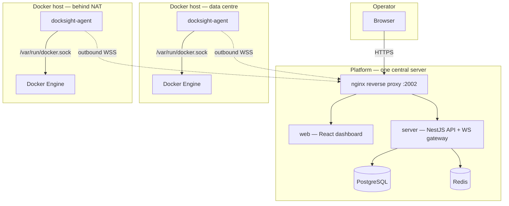
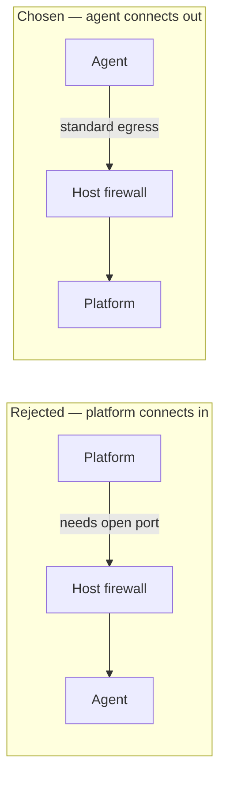
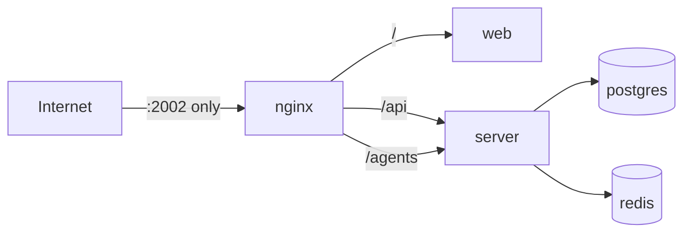
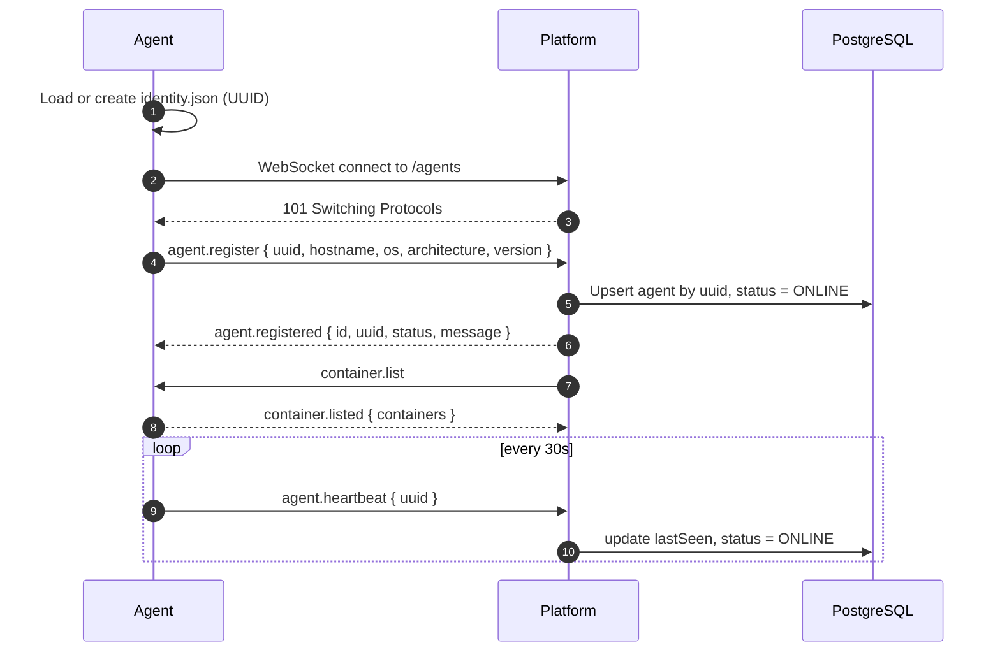
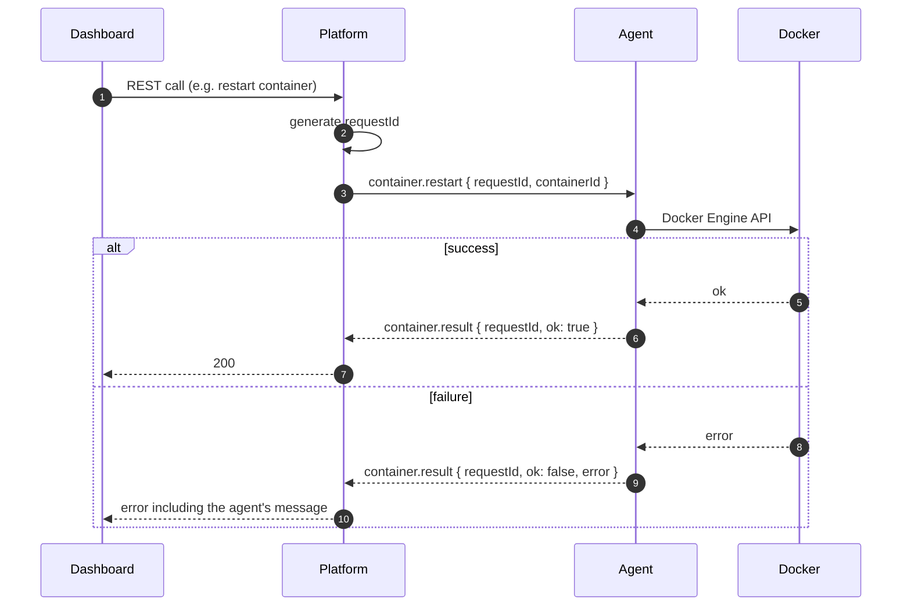
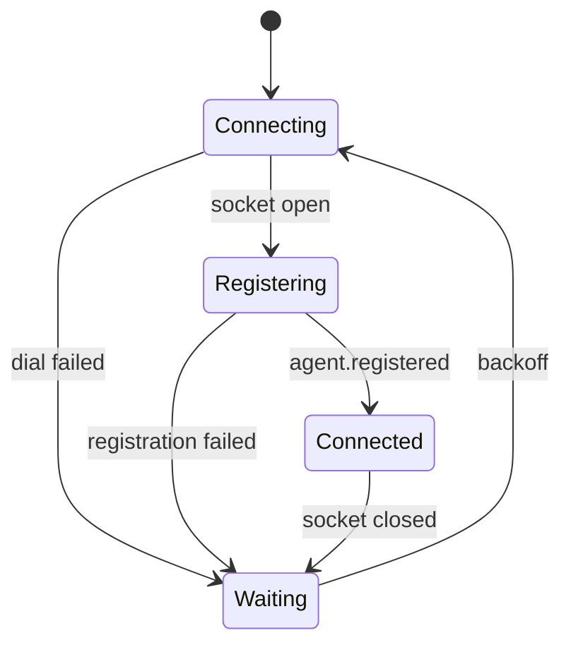

# Architecture

This page explains how DockSight is put together and — more importantly — *why*.
Every design decision here has a cost and a reason; both are stated.

---

## System overview



Only two kinds of connection exist: a browser talking to nginx, and agents
dialling nginx. Nothing ever connects *to* a Docker host.

---

## Components

### Platform

| Service | Image | Role |
| --- | --- | --- |
| `nginx` | `nginx:1.25-alpine` | The only published port. Routes `/` to the dashboard, `/api` and `/agents` to the backend. |
| `web` | `ghcr.io/Open-Source-Kigali/docksight-web` | React + TypeScript dashboard. |
| `server` | `ghcr.io/Open-Source-Kigali/docksight-server` | NestJS modular monolith: REST API, WebSocket gateway, Prisma. |
| `postgres` | `postgres:17-alpine` | Source of truth: hosts, agents, users, audit. |
| `redis` | `redis:7-alpine` | Cache and pub/sub for realtime fan-out. |

The server is a **modular monolith**, not microservices: domain modules
(`agents`, `containers`, `hosts`, `logs`, `metrics`, `auth`, `audit`) live in one
deployable. Module boundaries are enforced in code so a service can be extracted
later if it earns it — but a young project pays the operational cost of
microservices long before it collects the benefit.

### Agent

A single static Go binary with no runtime dependencies. Internally:

| Package | Responsibility |
| --- | --- |
| `communication` | WebSocket client, registration, heartbeat, reconnect, message dispatch |
| `docker` | Docker Engine SDK access over the local socket or named pipe |
| `identity` | Durable UUID persisted to disk |
| `config` | YAML configuration loading with defaults |
| `logs` | Container log streaming |
| `lifecycle` | Startup and graceful shutdown |

### CLI

The `docksight` binary installs and updates everything. It is a separate release
artifact from both the platform bundle and the agent — see
[Release process](release-process.md).

---

## Why WebSocket?

The platform needs to *push* commands to hosts and receive a *stream* of logs
back. The candidates:

| Approach | Why it was rejected |
| --- | --- |
| **Agent polls REST** | Latency is bounded by the poll interval. Fast commands mean aggressive polling; idle fleets waste requests. Log streaming becomes an awkward chunked-transfer hack. |
| **Platform calls the agent's HTTP API** | Requires an inbound port on every Docker host — the exact problem DockSight exists to avoid. |
| **gRPC streaming** | Technically a good fit, but adds a proto toolchain to a Go agent *and* a TypeScript backend, and needs extra plumbing through proxies that only speak HTTP/1.1. |
| **WebSocket** | One long-lived, bidirectional, ordered connection. Native in Node and Go. Survives ordinary HTTP proxies. Upgrades from `ws://` to `wss://` with no application change. |

The cost is that WebSocket gives you a byte pipe and nothing else — no request
correlation, no retries, no schema. DockSight adds those back in a thin
[message envelope](websocket-protocol.md): every message is
`{ "type": "domain.action", "payload": {...} }`, and commands carry a
`requestId` their responses echo.

---

## Why agents dial out

This is the single most consequential decision in DockSight.



What outbound-only buys you:

- **Works behind NAT.** Home labs, office networks, private subnets and most
  cloud defaults permit outbound 443 while blocking inbound entirely.
- **No inbound attack surface on the host.** A machine with the Docker socket on
  it is the most valuable target in the deployment; it exposes nothing.
- **No per-host firewall work.** Adding a host is installing a binary, not filing
  a network change.
- **Failure is contained.** A compromised platform can send messages an agent
  chooses to honour. It cannot reach the host's Docker socket directly.

The costs, stated honestly:

- The platform **must** be reachable from every host. It is a single point of
  failure for control (though not for the containers themselves, which keep
  running when the platform is down).
- The platform cannot initiate contact with an offline agent — it waits for the
  agent to reconnect.
- Because the agent chooses the platform, an agent's trust in the platform is
  established by configuration rather than by a certificate check today. See
  [Security](security.md).

---

## Why the backend sits behind nginx

`server` and `web` publish **no ports** of their own. Only nginx binds a host
port (`2002` by default). That yields:

1. **One TLS termination point.** Certificates are configured once, not per
   service.
2. **One origin for the browser.** Dashboard, REST API and WebSocket endpoint
   share a hostname, so there is no CORS configuration and no mixed
   `ws://`/`https://` combination to get wrong.
3. **A stable public path layout** (`/`, `/api`, `/agents`) decoupled from
   internal service names and ports.
4. **The database is unreachable from outside.** `postgres` and `redis` sit only
   on the internal `docksight-network` bridge. Nothing published, nothing to scan.



!!! note "Ports"
    Only `${DOCKSIGHT_PORT:-2002}` is published to the host. Change it in
    `/opt/docksight/.env` and restart the stack.

---

## Registration flow

When an agent starts — or reconnects after any interruption — it registers
before doing anything else.



The **UUID is generated by the agent**, not the platform, and persisted at
`/etc/docksight-agent/identity.json`. That single choice is what makes the
system idempotent: reinstall the agent, upgrade it, reboot the host, and the
platform still sees the same host with its existing history. It is also why the
installer never overwrites that file — see [Agent](agent.md#identity).

---

## Command flow



`requestId` correlation means the platform can have many operations outstanding
on a single socket, and a slow `docker stop` never blocks a concurrent log
stream. Docker errors propagate verbatim rather than being flattened into a
generic failure — the operator sees what Docker actually said.

---

## Heartbeat and liveness

The agent sends `agent.heartbeat` every **30 seconds** after registering.

Why bother, when TCP already has keepalives? Because a TCP connection can remain
open through a NAT device long after the peer stopped functioning. A heartbeat at
the application layer proves the agent's *event loop* is alive, not merely that a
socket exists.

The platform updates `lastSeen` on each heartbeat and marks agents `OFFLINE`
when the socket closes. There is deliberately **no acknowledgement**: silence
from the platform is normal, and an ack would double traffic to tell the agent
something the socket already tells it.

---

## Reconnection



The agent reconnects with exponential backoff capped at 30 seconds, plus jitter,
so the wait before each attempt is variable. It re-registers each time.
Because registration is an upsert keyed by UUID, reconnecting is harmless and
repeatable — no cleanup, no session resumption, no duplicate host records.

Jitter is what keeps a fleet from reconnecting in a single wave after a
platform restart. See [Protocol](protocol.md#4-connection-lifecycle).

!!! info "Containers keep running"
    A disconnected agent does not stop anything. Containers run normally; only
    *management* is unavailable until the agent reconnects.

---

## Networking summary

| Connection | Direction | Port | Encrypted |
| --- | --- | --- | --- |
| Browser → platform | inbound to platform | 2002, or 443 behind your TLS proxy | HTTPS when you terminate TLS |
| Agent → platform | outbound from host | same as above | `wss://` when the platform URL uses `https://` |
| Agent → Docker | local only | Unix socket | n/a — never leaves the host |
| server → postgres / redis | internal bridge | 5432 / 6379 | internal network only |

The agent's scheme is derived from the platform URL given at install time:
`https://` becomes `wss://`, `http://` becomes `ws://`. See
[Agent configuration](agent.md#configuration).

---

## Repository layout

```text
docksight/
├── apps/
│   ├── web/         React dashboard
│   ├── server/      NestJS API + WebSocket gateway
│   ├── agent/       Go agent (separate Go module)
│   └── cli/         Go CLI: installer and updater
├── packages/
│   ├── protocol/    Shared TypeScript protocol contracts
│   ├── types/       Shared TypeScript types
│   ├── config/      Shared defaults
│   └── utils/       Cross-app helpers
├── bundle/          Platform bundle sources (compose, nginx, .env.example)
├── scripts/         build-release.sh, publish-release.sh
└── docs/            This documentation
```

More detail in [Development](development.md#repository-structure).

---

## Design principles

1. **Modular monolith first** — extract services only when a real constraint
   demands it.
2. **Docker-only scope** — no orchestrator abstractions in the core product.
3. **Outbound-only agents** — the network model is a feature, not an accident.
4. **Independent artifacts** — CLI, platform and agent version and ship
   separately, so one can be upgraded without the others.
5. **Idempotent installers** — every install command is safe to re-run, and
   re-running is the supported upgrade path.
6. **Honest failures** — surface the underlying error and the next command to
   run, rather than a generic message.

---

## Related reading

- [WebSocket protocol](websocket-protocol.md) — the wire format in depth.
- [Protocol specification](protocol.md) — field-level reference and source of truth.
- Architecture decision records: [`docs/decisions/`](https://github.com/Open-Source-Kigali/docksight/tree/develop/docs/decisions).
