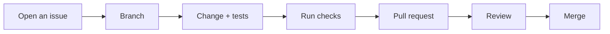

# Contributing

Contributions are welcome. This page covers the workflow; see
[Development](development.md) for how to build and test.

---

## Getting started

```bash
git clone https://github.com/Open-Source-Kigali/docksight.git
cd docksight
npm install

cd apps/cli && go test -short ./...
cd ../agent && go test ./...
```

If the test suites pass, your environment is ready.

---

## Workflow



1. **Open an issue first** for anything non-trivial. It is cheaper to disagree
   about an approach in an issue than in a finished pull request.
2. **Branch** from `develop`: `feat/agent-metrics`, `fix/env-permissions`,
   `docs/protocol-clarification`.
3. **Make the change**, with tests.
4. **Run the checks** below.
5. **Open a pull request** describing the problem, the approach, and how you
   verified it.

---

## Before you push

```bash
cd apps/cli
gofmt -l .          # must be empty
go vet ./...
go test -short ./...

cd ../agent
gofmt -l .
go vet ./...
go test ./...

cd ../..
npm run lint
npm run build
```

CI runs the same commands. `-short` skips tests that hit the live GitHub API.

---

## Commit messages

```text
<type>: <what changed>

<why it changed, if not obvious>
```

Types: `feat`, `fix`, `docs`, `refactor`, `test`, `chore`.

```text
fix: preserve agent identity across reinstalls

Rewriting identity.json made the platform treat an upgraded host as a new
one, orphaning its history. The installer now leaves the file alone.
```

Explain the *why*. The diff already shows the *what*.

---

## Pull requests

A good pull request:

- Does one thing. Split unrelated changes.
- Includes tests for new behaviour and for the bug being fixed.
- Updates documentation in the same change, not "later".
- Explains how it was verified — the commands you ran, the output you saw.
- Notes anything intentionally left out.

If a change alters the protocol, [`docs/protocol.md`](protocol.md) and
`packages/protocol` must be updated in the same commit.

---

## What makes a change easy to accept

**Tests that would fail without the fix.** A regression test that passes against
the old code is not testing the fix.

**Honest failure paths.** Errors should say what went wrong *and* what to do
next. Compare:

```go
return fmt.Errorf("check failed")

return fmt.Errorf(
    "cannot reach the Docker daemon: permission denied. "+
    "Run as root, or add this user to the docker group",
)
```

**Respect for the layering.** Internal packages must not import `ui`; they report
through `progress.Reporter`. This is what lets installers run under test, and it
is the rule most often broken by new contributors.

**Idempotence.** Anything that touches a host should be safe to run twice. Ask
what happens on the second run, and test it.

---

## Documentation contributions

The documentation is MkDocs Material in `docs/`. Preview it either way:

```bash
# Docker — nothing to install.
# On Git Bash for Windows, prefix with MSYS_NO_PATHCONV=1
docker run --rm -it -p 8000:8000 -v "${PWD}:/docs" \
  squidfunk/mkdocs-material serve -a 0.0.0.0:8000

# or a local Python toolchain
pip install -r requirements-docs.txt
mkdocs serve
```

See [Development](development.md#documentation) for details.

Conventions:

- Explain *why* before *how*.
- Use real, runnable commands and real output. Invented output is worse than
  none.
- Use admonitions for genuine warnings, not decoration.
- Mermaid for diagrams, so they stay diffable.
- Cross-link rather than repeat. [`protocol.md`](protocol.md) is the single
  source of truth for message shapes; other pages link to it.
- Do not describe unimplemented behaviour as if it exists. Mark placeholders
  explicitly — several commands are placeholders today and the docs say so.

---

## Reporting bugs

Include:

- What you ran, verbatim
- What you expected
- What happened, with full output
- `docksight version`, OS and architecture
- For agent problems: `journalctl -u docksight-agent -n 50 --no-pager`
- For platform problems:
  `docker compose -f /opt/docksight/dockersight-installation.yml ps`

!!! warning "Redact before pasting"
    `.env` contains your database password and JWT secret. Journal output can
    contain hostnames and URLs. Remove them.

---

## Reporting security issues

**Do not open a public issue.** Contact the maintainers privately through GitHub
Security Advisories on the repository, and include:

- The affected component and version
- Reproduction steps
- The impact you believe it has

Known limitations already documented in [Security](security.md#current-limitations) —
unauthenticated agent connections, unenforced TLS — do not need a report; they
are tracked on the [Roadmap](roadmap.md).

---

## Code of conduct

Be direct about code and considerate about people. Review the change, not the
author. Assume good intent, ask questions before assigning blame, and prefer
"this breaks X because Y" over "this is wrong".
